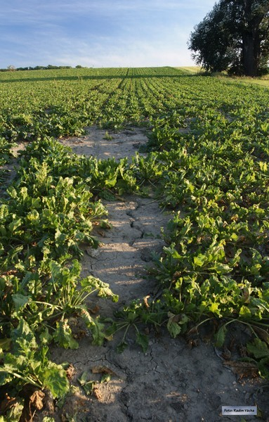
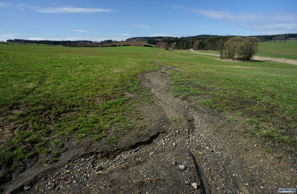
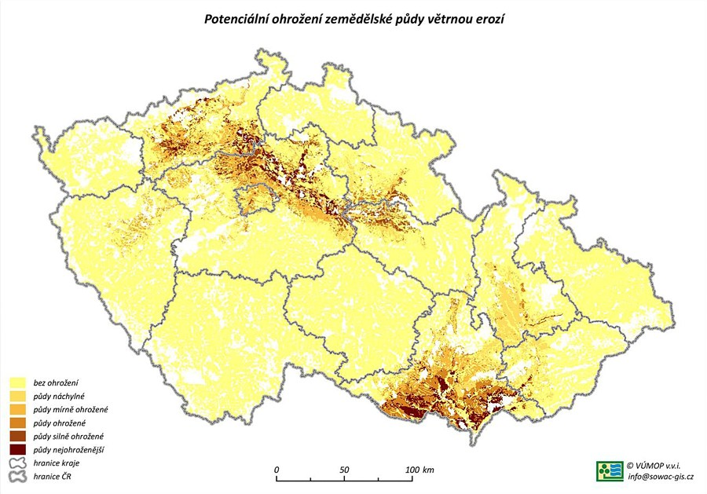
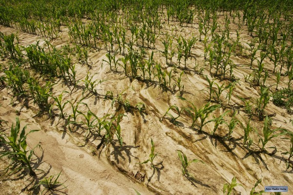

Ochrana zemědělské půdy před erozí
--------------------------------------
Eroze - ztráta půdy, uvolňování, transport 
----------------------------------------
	*	vodní - způsobená destrukční činností dešťových kapek a povrchového 
		odtoku, transport částic
	*	větrná
	*	ledovcová
	*	antropogenní
	

  
   *Ukázka eroze*  
   

  
   *Ukázka eroze*

.. note:: 	V České republice je vodní erozí ohroženo 50% zemědělské půdy a 10% zemědělské půdy je ohroženo větrnou erozí

	*Potenciální ohrožení zemědělské půdy větrnou erozí*

Vodní erozi způsobuje:
	*	smyv půdy o nejúrodnější část - ornici
	*	zhoršení fyzikálně-chemických vlastností půdy
	*	zmenšení mocnosti půdního profilu
	*	zvýšení štěrkovitosti
	*	snížení obsahu živin a humusu
	*	poškození plodin a kultury
	*	problematický pohyb strojů po pozemcích
	*	ztrátu osiv, sadby, hnojiv a přípravků na ochranu rostlin

	-> ohrožuje produkční funkce půdy a je příčinou velkých škod v intravilánech obcí

  
   *Ukázka eroze*
   
Díky transportu půdních částic dochází ke znečištění vodních zdrojů, 
k zanášení akumulačních nádrží, ke snižování kapacity toků, k zakalování povrchových vod, 
také zvyšují náklady na úpravu vody a těžbu usazenin, atd.
 	
Možnosti ochrany půdy před erozí
-----------------------------------
Po roce 1989, kdy docházelo k transformaci zemědělských družstev a k privatizaci, 
se očekával nový postoj k využití a ochraně půdy (šetrnější hospodaření, menší výrobní a územní celky,
rozmanitost plodin) 

Dnes - hlavní možnosti ochrany půdy před erozí
	*	v rámci plánu společných zařízení (5 - 7% plochy) při pozemkových úpravách realizovat protierozní opatření (PEO):
				*	meze, příkopy, průlehy, hrázky, terasy, nádrže, zatravněné údolnice
				*	TTP (sklon nad 25%), zalesnění, vhodné plodiny - pásové střídání, nepřekročení přípustné délky svahu
				*	změna velikosti a tvaru pozemku (malé, nepravidelné, 1:2 až 1:3 ve směru vrstevnic), delimitace kultur
				*	vrstevnicové obdělávání, mulčování

	*	erozně ohrožené pozemky - aktivní spolupráce zemědělců
	
USLE - Univerzální rovnice pro výpočet dlouhodobé ztráty půdy erozí 
-------------------------------------------------------------------
Metoda dle WISCHMEIERA a SMITHE, 1978

Pro zjištění ohroženosti zemědělských půd vodní erozí a k hodnocení účinnosti navrhovaných protierozních opatření (PEO) se používá 
→ Univerzální rovnice pro výpočet dlouhodobé ztráty půdy erozí - USLE
	*	odvozena v USA na mnoha experimentálních plochách
	
		- tzv. jednotkové pozemky mají jednotné parametry: délka 22,13 m, sklon 9 %, trvalý úhor obděláván ve směru sklonu

Ztráta půdy se stanoví podle vzorce:

		:math:`G = R \times K \times L \times S \times C \times P`	  (:math:`t.ha^{-1} . rok^{-1}`)
   
kde je

	*	R faktor erozní účinnosti deště (:math:`MJ.ha^{-1} .cm.h^{-1}`)
	*	K faktor erodovatelnosti půdy (:math:`t.h.MJ^{-1} .cm^{-1} .rok^{-1}`)
	*	L	faktor délky svahu (-)
	*	S	faktor sklonu svahu (-)
	*	C 	faktor ochranného vlivu vegetačního pokryvu (-)
	*	P	faktor účinnosti protierozních opatření (-)
 
G - průměrná dlouhodobá ztráta půdy (:math:`t.ha^{-1} . rok^{-1}`), množství půdy uvolněné vodní erozí
	Výsledkem je hodnota průměrné roční ztráty půdy G vztažená k celé části pozemku, který je charakterizován daným profilem - hodnota slouží ke stanovení erozní ohroženosti pozemku.
	U středně hlubokých/hlubokých půd: hodnota přípustné ztráty půdy: :math:`4t.ha^{-1} . rok^{-1}` (udržení dostatečné úrovně úrodnosti půdy).
	
Zpracování úlohy průměrné dlouhodobé ztráty půdy v QGISu
--------------------------------------------------------
QGIS je svobodný a multiplatformní GIS. Vývoj (od roku 2002) zajišťuje skupina dobrovolníků. 
Verze s označením 1.0 vyšla na začátku roku 2009. QGIS je psán v jazyku C++, grafické uživatelské rozhraní 
je postaveno na knihovně Qt. Zásuvné moduly je možné vytvářet v C++ nebo Pythonu. QGIS umožňuje zejména prohlížení, 
tvorbu a editaci rastrových a vektorových dat, zpracování GPS dat a tvorbu mapových výstupů. Funkčnost rozšiřují zásuvné moduly, 
např. významný modul zpřístupňující funkce GRASS GIS.

Verze: QGIS 2.8.1 Wien

Vstupní data:
	*	vrstva povodí IV. řádu
	*	DMT v rozlišení 10 x 10 m
	*	HPJ - hlavní půdní jednotky z kódu BPEJ
	*	KPP - komplexní průzkum půd
	*	základní báze geografických dat - ZABAGED
	*	ortofotomapa

Zpracování jednotlivých faktorů USLE:
	*	**R faktor erozní účinnosti deště** - vyjadřuje účinek srážek na velikosti ztráty půdy
		Určení:
		Pro zemědělské pozemky v ČR se používá průměrná hodnota R faktoru 
		
		(:math:`R = 40 \, MJ.ha^{-1} .cm.h^{-1}`)
	*	**K faktor erodovatelnosti půdy (náchylnost půdy k erozi)** - odnos půdy v tunách z 1 ha na jednotku dešťového faktoru R ze standardního pozemku, závisí na textuře, struktuře, propustnosti, obsahu organické hmoty.
		Určení:
		Přibližně podle bonitační soustavy půd (BPEJ), nutno znát hodnotu HPJ: 2 a 3 čísla kódu BPEJ. Pokud pro některou HPJ není uvedena hodnota K faktoru, lze určit podle klasifikace půd.
	*	**LS faktor délky a sklonu svahu** - s rostoucí délkou a se zvětšujícím se sklonem svahu se zvyšuje intenzita eroze.
		Určení:
		
		LS faktor lze vypočítat podle vzorce:
		
		:math:`LS = (accu \times \frac{10.0}{22.13})^{0.6} \times (\frac{sin(slope \times \frac{pi}{180})}{0.09})^{1.3}`

		“accu” - rastrová mapa znázorňující akumulaci toku v každé buňce, přiděluje každé buňce rastru počet buněk, ze kterých voda odtéká do dané buňky.
		
		“slope” - rastrová mapa znázorňující sklonové poměry, ve stupních
	*	**C faktor ochranného vlivu vegetace** - vegetace chrání povrch půdy před dešťovými kapkami, zpomaluje rychlost povrchového odtoku.
		Určení:
	*	**P faktor účinnosti protierozních opatření** -  protierozní opatření nejsou na pozemcích uplatněna. 
		Určení:
		:math:`P = 1`

Zdroje
----------
* `[1] Metodika ochrany zemědělské půdy <http://fzp.czu.cz/vyzkum/metodiky/Metodika_Ochrana_zemedelske_pudy_pred_erozi.pdf>`_
* `[2] Metodika_GIS.pdf <>`_
* `[3] PEO <http://storm.fsv.cvut.cz/on_line/yhmh/YHMH_2011_2_PEO1xx.pdf>`_
* `[4] USLE <http://storm.fsv.cvut.cz/on_line/vhk2/eroze%2006_USLE.pdf>`_
* `[5] Fotografie eroze <http://www.vumop.cz/index.php?p=fotogalerie&site=default&tag_id=>`_
* `[6] Informace o QGISu <https://cs.wikipedia.org/wiki/QGIS>`_